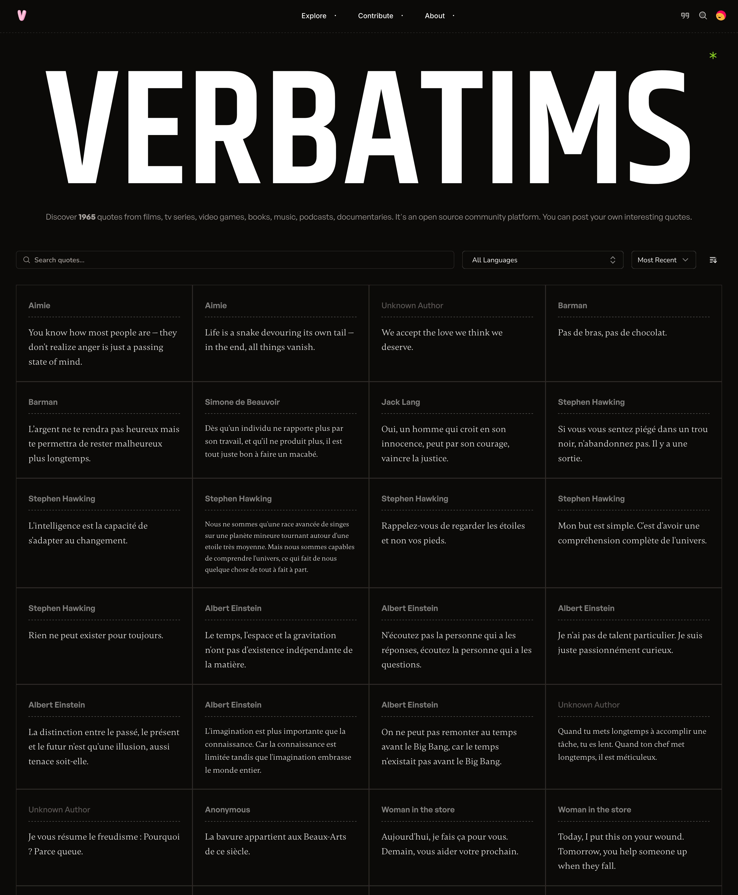

# verbatims

Quote service for discovering, curating, and sharing timeless words — with moderation and admin workflows.



## Overview

verbatims brings quotes, sources, and context together in one place. Browse by topic or author, build personal collections, and quickly share cleanly attributed quotes. The project focuses on accuracy, thoughtful curation, and a pleasant reading experience.

Key ideas:
- Delightful discovery with fast search and smart ranking
- Accurate attribution with references to primary sources where possible
- Community submissions with moderation for quality and clarity
- Clean sharing: copy attribution-ready text or export visuals

## Features

- Browse and search by topic, author, keyword, or reference
- Save favorites and build collections
- Contribute quotes with sources (moderation workflow)
- Report issues (typos, attribution, duplicates)
- Share formatted quote cards or copy clean text with attribution
- Accessible UI: keyboard navigation, high contrast, screen-reader labels

## Tech stack

- Nuxt 3 (Vue 3) for the application framework and SSR
- Pinia for state management
- UnaUI + UnoCSS for UI primitives and utility-first styling
- Nuxt Image for image handling and optimization
- NuxtHub (Cloudflare D1/SQLite) for database and deployment on Cloudflare Pages
- Auth via `nuxt-auth-utils` (role-based: user, moderator, admin)

See exact versions in `package.json` and configuration in `nuxt.config.ts`.

## Architecture

- Frontend: Nuxt 3 with SSR/SPA hybrid
- Database: Cloudflare D1 (SQLite) via NuxtHub
- API: File-based routes under `server/api/*`
- Auth: `getUserSession(event)` on server, `useUserSession()` on client
- State: Pinia stores for global state and preferences
- Deployment: Cloudflare Pages via NuxtHub

Helpful references:
- Schema: `server/database/migrations/schema.sql`
- Types: `types/` (e.g., `Quote`, `QuoteWithRelations`)
- Layouts: `layouts/` (`admin.vue`, `dashboard.vue`, `default.vue`)
- Admin pages: `pages/admin/*`
- Composables: `composables/` (e.g., `useDataExport.ts`)

## Getting started

Prerequisites: Node 18+ and your preferred package manager. The project uses Bun by default, but npm/pnpm/yarn work too.

Install dependencies:

```bash
bun install
```

Start the dev server at http://localhost:3000:

```bash
bun run dev
```

Build for production:

```bash
bun run build
```

Preview the production build locally:

```bash
bun run preview
```

NuxtHub will provision a local D1 database automatically. The SQL schema lives in `server/database/migrations/schema.sql` and is applied through the NuxtHub integration.

## Scripts

The most common scripts are:

- `bun run dev` – start development server
- `bun run build` – production build
- `bun run preview` – preview the production build

Note: The legacy local CLI utilities under `scripts/` have been removed. Admin operations are now performed through the in-app Admin pages and server APIs (e.g., export, import, backup).

## Data, privacy, and contributions

- Submissions are verified for wording and authorship before publishing; misattributions may be corrected or declined.
- Community reports with citations are encouraged.
- We store only what’s needed to run the app (account info, favorites, collections, preferences). We don’t sell personal data.
- See in-app pages for details: `/privacy` and `/terms`.

## Deployment

This app targets Cloudflare Pages with NuxtHub. Follow Nuxt’s deployment docs and the NuxtHub guide for Cloudflare Pages. CI typically runs `nuxt build` and deploys the output using Cloudflare tooling.

## Contributing

Issues and PRs are welcome. Please follow the established code style (TypeScript, strict types, UnoCSS utilities, UnaUI components) and keep UI accessible.

## License

This project is licensed under the MIT License – see `LICENSE`.
